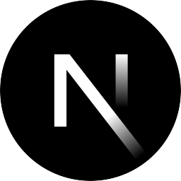

# [House of Mystery](https://houseofmystery.github.io)

- [House of Mystery](#house-of-mystery)
  - [Demo](#demo)
  - [Projects](#projects)
  - [Templates](#templates)

## Demo

-  [APIs](https://houseofmystery.github.io/apis)
-  [Apps](https://houseofmystery.github.io/apps)
-  [Components](https://houseofmystery.github.io/components)
-  [Data](https://houseofmystery.github.io/data)
-  [Themes](https://houseofmystery.github.io/themes)

## Projects

- ☕ [CafeSang](https://houseofmystery.github.io/cafesang)

## Templates

-  [Next.js](https://github.com/houseofmystery/nextjs-template)
